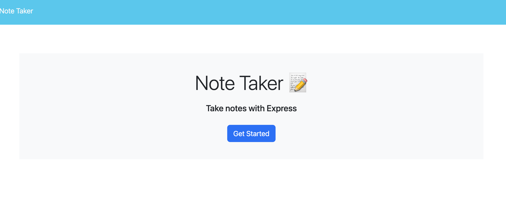

# Note Taker
## Description
Simple app that will allow the user to make a list of notes that can be stored for future reference.

## Features
* Express.js
* Node.js
* JavaScript
* Path module
* UUID module

## Image

## Deployed Heroku App Link
[Heroku App](https://xpressnotetaker.herokuapp.com)

## Credits
Many thanks to my instructor and cohort TA.
